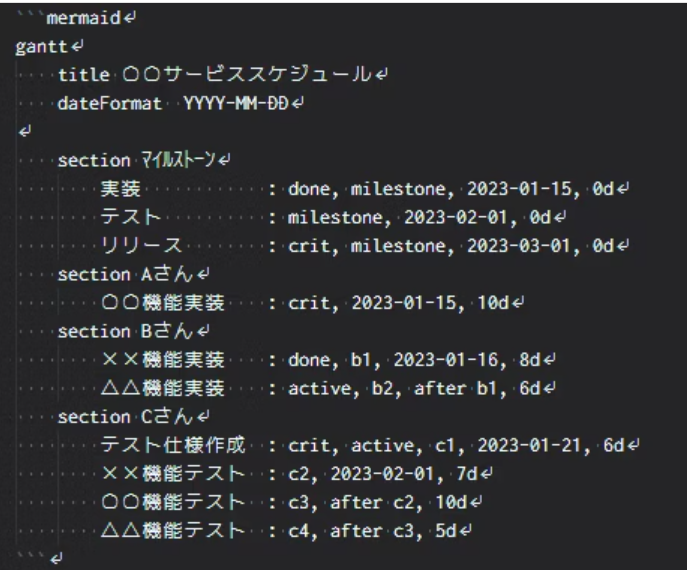
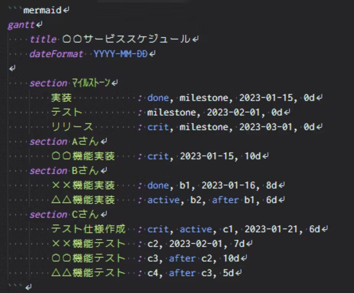

## VSCodeでmermaidを利用する方法や便利な拡張機能

##### マーメイド記法を利用する際にはコードの初めにつける```の横に"mermaid"と記述すると表示したいコードがプレビューに表示されます。

graph TD;
    A-->B;
    A-->C;
    B-->D;
    C-->D;
##### 例えばこのような↑フローチャートをマーメイド記法で表示する為に```で囲むと↓

```
graph TD;
    A-->B;
    A-->C;
    B-->D;
    C-->D;
```
##### 更に最初の```の横にmermaidを記述すると

##### ↑このような感じで自分の表示したいコードをマーメイド記法を使い表示させることができます。

## 便利な拡張機能

### 1. Markdown Preview Mermaid Support
- **使い方**
拡張機能をインストールするだけで、特に設定を変更することなくプレビュー時に図が表示されるようになります。
先ほどのコードも、拡張機能インストールした後は以下のようにガントチャートが表示されるようになりました。

### 2. Mermaid Markdown Syntax Highlighting
- **使い方**
この拡張機能もインストールをするだけで使えます。
また、特に設定項目もありません。
- 導入前

引用元↑↓(https://qiita.com/sato_kana/items/2a13f19017576488f017#:~:text=Mermaid%20%E3%81%A8%E3%81%AF%E3%80%81%E3%82%B3%E3%83%BC%E3%83%89%E3%83%99%E3%83%BC%E3%82%B9,%E3%82%88%E3%81%86%E3%81%AB%E3%81%AA%E3%82%8A%E3%81%BE%E3%81%97%E3%81%9F%E3%80%82)
- 導入後

このように、導入するだけでMermaid記法をした箇所に色がつくようになり、非常にコードが見やすくなりました。

### 3. Markdown PDF
- **使い方**
特に設定変更をすることなく使用が出来ます。
出力したいMarkdownファイルを開き、コマンドパレットで出力形式を選択するとMarkdownのあるフォルダにファイルが出力されます。
