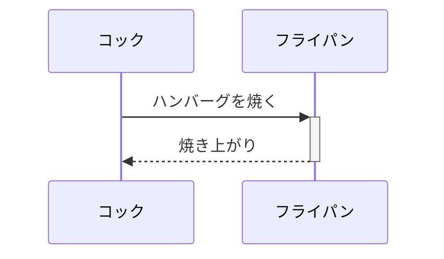

# mermaidで記述できるダイアグラムのチュートリアル

引用元(https://qiita.com/konitech913/items/90f91687cfe7ece50020)
今回は↓
## Sequence diagram
を正しく使用するためのチュートリアルを説明していきます。

まずは書きたいコードを書きましょう。
今回は例としてコックがフライパンでハンバーグを焼くシーケンス図を書いていきます。

```
sequenceDiagram
participant cook as コック
participant kitchenware1 as フライパン
cook ->>+ kitchenware1: ハンバーグを焼く
kitchenware1 -->>- cook : 焼き上がり
```
上記のcodeをマーメイド記法で表示すると下記のようになります。



優れている点として、ただcodeを書いただけで、文字や線や図形を書き込めるところです。
ご紹介したのはSequence diagramですが、他のダイアグラムを利用する場合はそのダイアグラムに合ったコードを書くと良いでしょう。