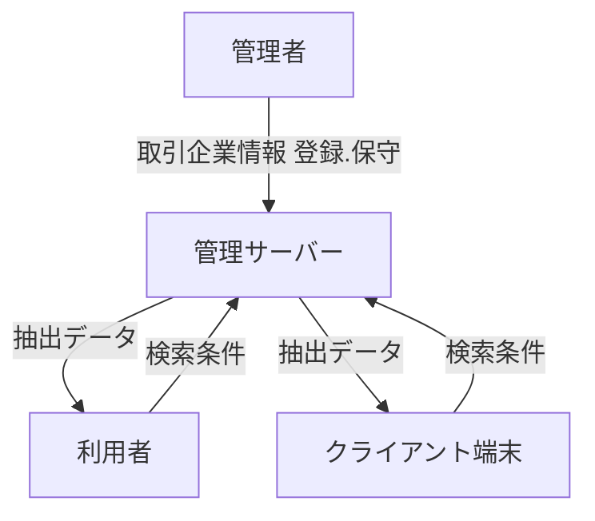

ネットワーク経由で複数マシンからアクセス

```mermaid
graph TD;
    管理サーバー-->|抽出データ|利用者;
    管理サーバー-->|抽出データ|クライアント端末;
    利用者-->|検索条件|管理サーバー;
    クライアント端末-->|検索条件|管理サーバー;
    管理者-->|取引企業情報 登録.保守|管理サーバー;
```
### 利用者操作
・初めて利用する場合は、ユーザー登録を行う
・ブラウザよりログインして利用する
・ブラウザを利用して、条件を入力し情報を取得する
### 管理者操作
・ブラウザよりログインして利用する
・ブラウザより企業情報を登録・保守を行いデータベースを管理する